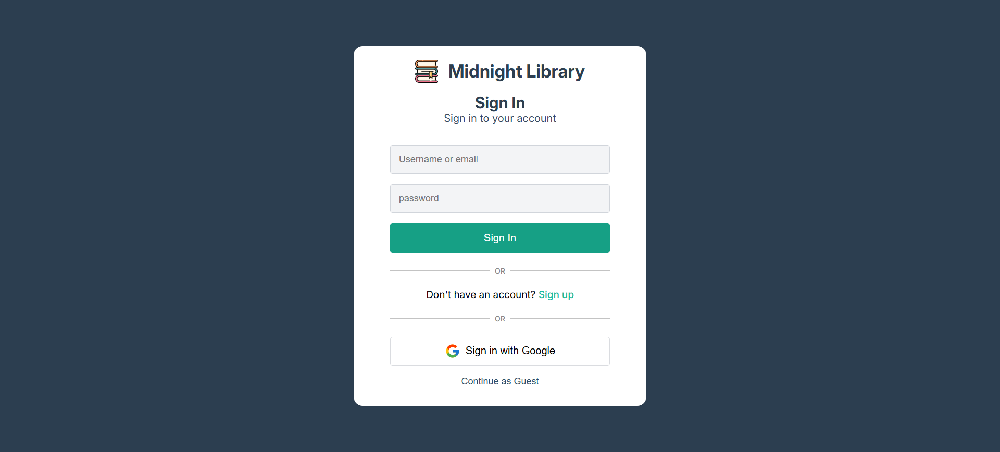
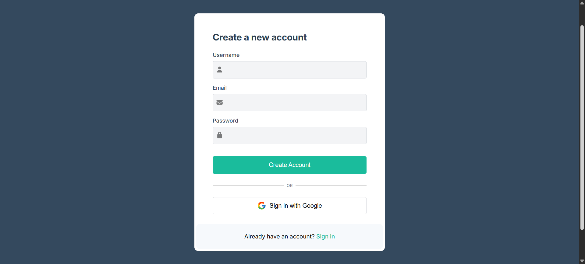
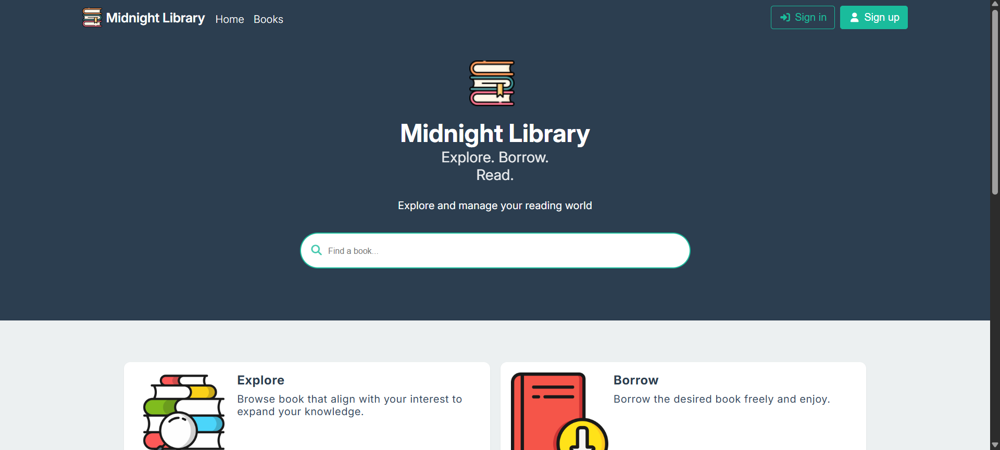
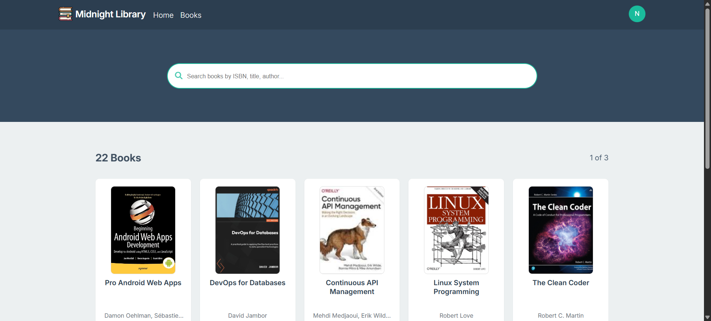
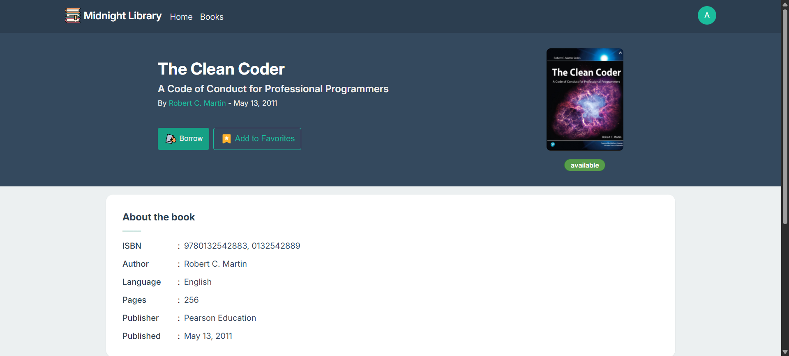
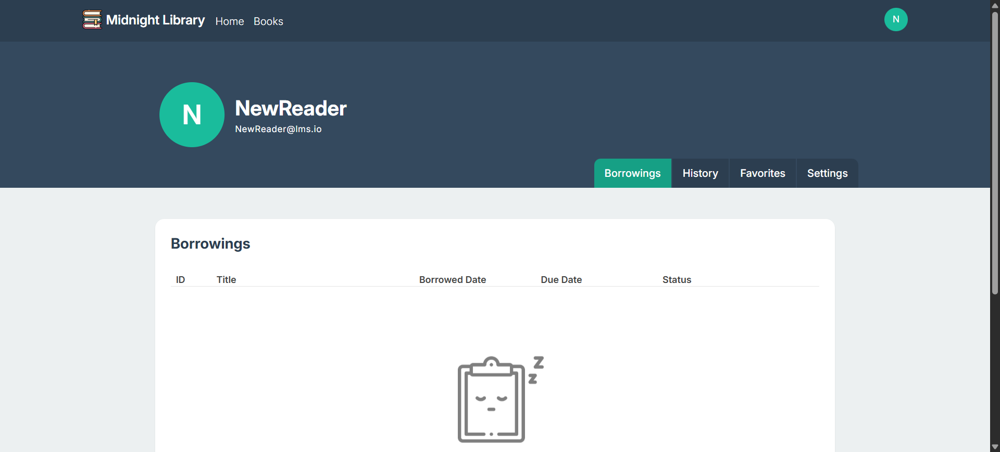
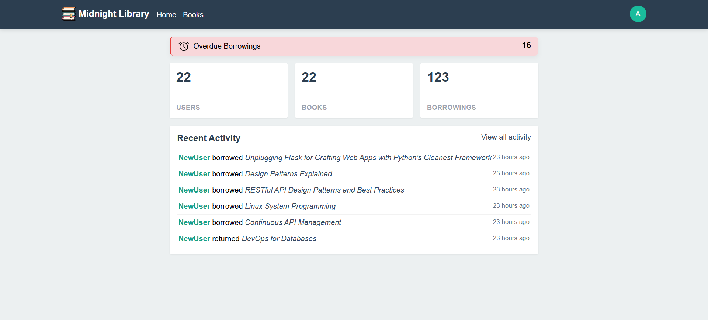

<h1 align="center">
 Midnight Library

</h1>

A full-stack Library Management System built to manage users, books, and borrowing workflows with secure authentication and admin control

## 📝 Description

Midnight Library is a web-based system designed to manage a library's books, users, and borrowing workflows, with a focus on clean structure, security, and administrative control.

## ⭐ Features

- 🍪 User authentication with secure, HTTP-only cookie-based sessions
- 🛡️ Role-based access control (Admin and regular users)
- 🔍 Browse, search, and view available books
- 📕 Borrow and return books with availability tracking
- ⏳ Overdue dates tracking
- 👨🏻‍💼 Admin management of books and users
- 🟢 Real-time activity log and KPIs

## 🔧 Technical Highlights

- Backend built with Falsk following a modular, layered architecture
- PostgreSQL used for relational data modeling
- Custon authentication implemented using JWTs stored in secure, HTTP-only cookies
- Clean separation between API endpoints, business logic, and data access layers

## 🛠️ Tech Stack

- Backend: Flask (Python)
- Frontend: JavaScript, HTML, CSS
- Database: PostgreSQL

## 🖼️ Visuals

<h3 align="center"> 🔐 Sign In </h3>

        

<h3 align="center"> 📝 Sign Up </h3>

    

<h3 align="center"> 🏠 Home Page </h3>

    
     
    <em>Main landing page of the library</em>

<h3 align="center"> 🔍 Browse Books </h3>

    
     
    <em>Book search and browsing interface</em>

<h3 align="center"> 📖 Book Details </h3>

    
     
    <em>Detailed view of a selected book</em>

<h3 align="center"> 👤 Profile </h3>

    
     
    <em>Registered user profile page</em>

<h3 align="center"> 📊 Admin Overview </h3>

    

## 🚧 Project status

- This project is under development and intended for learning and portfolio porpuses.
- Core functionality is implemented, while some features and refinements are still in progress.

---

## 💬 Contact

Suggestions for new features or improvements are welcome and appreciated.

    
    
    

---

<em> Midnight Library is still under active development </em> 

